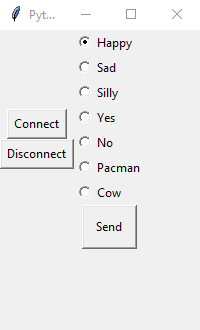

{:.ui .image .small .floated .right}

It is possible to send commands to the microbit over a serial connection from your computer. The `REPL` function in the mu editor is simply a serial connection. For example, `display.show(Image.HAPPY)` causes a face to show on the microbit's display.

There's [more about the USB serial connection on our website](http://localhost:4000/howto/microbit-serial-connection-over-usb).

To send Python commands, the microbit must be running a micropython `.hex` file (eg, created in mu).

In this example, a Python GUI program sends commands to the microbit flashed in mu with a blank script.

### About the Program

This program uses two Python modules: pySerial and GUIZero.

* pySerial handles the serial communication. It scans for the microbit and creates a serial connection.

* GUIZero is for drawing the GUI. It is a learner-friendly wrapper for TKInter.

#### pySerial

Handles the serial connection to the microbit.

##### `find_microbit_comport()`

```
def find_microbit_comport():
    ports = list(list_ports.comports())
    for p in ports:
        if (p.pid == 516) and (p.vid == 3368):
            return str(p.device)
```

This function returns a string of the microbit's COM port. On Windows this might be `COM3`, on Linux `/dev/ttyS2`.

The `product ID` & `vendor ID` of each attached device is evaluated. If it is the same as the ones on a microbit (`516` & `3368`) then return the device name (eg COM4).

`serial.tools.list_ports` must be imported.

##### Initialise

Create a new instance of the Serial class as `ser`:

```
ser = serial.Serial()
```

Set `ser` baud rate to 115200. This is the default baud rate of the microbit:

```
ser.baudrate = 115200
```

Set the `ser` COM port to the one found by `find_microbit_comport()` .

```
ser.port = find_microbit_comport()
```

##### Writing Data

Before writing data the COM port must be opened. `Serial.open()` throws an exception if a connection cannot be made.

```
ser.open()
```

With the COM port open, we can write a command:

```
ser.write("display.show(Image.HAPPY) \r".encode() )

```

The `\r` is a carriage return. It tells `REPL` on the microbit that return has been pressed and it should execute the line sent.

`.encode()` turns the string into bytes.

### GUI Zero

GUI Zero is a learner-friendly wrapper for `Tkinter`. It allows beginners to easily create GUIs for the program by removing many of the complexities of `Tkinter`.

It's still at the beginning phase and I'm hoping this is the first program using it!

##### App window

The program's window is an instance of the `App` class. In this example it's assigned to `app`.

```
app = App()

# The app window can be modified by with parameters.
# EG app = App(title="My Microbit Program") for a title.
# The width, height, and other things can be changed.
```

[App() GUIZero docs](https://lawsie.github.io/guizero/pushbutton/)


##### Create Button

```
connect_button = PushButton(app, text="Connect", command=connect)

# create an instance of the PushButton class.
# The GUI parent (or master) is app (main app window).
# Text is "Connect"
# When it is clicked, connect() is executed
```

[PushButton() GUIZero docs](https://lawsie.github.io/guizero/pushbutton/)

##### Display the GUI

The final line is `app.display()`. This renders the GUI we have set up.

##### Note About Box()

`Box()` in GUIZero extends the `Frame` class in `Tkinter`. It allows GUI elements such as `PushButton()` or `ButtonGroup()` to be arranged together.

```
button_box = Box(app)
```

In the example below, the `connect` and `disconnect` sit within the `button_box` instance of `Box()`

```
connect_button = PushButton(button_box, text="Connect", command=connect)
```

This allows the collection buttons to sit together in the GUI.

[Box() GUIZero docs](https://lawsie.github.io/guizero/box/)

### Final Code



from guizero import *

import serial
from serial.serialutil import SerialException
from serial.tools import list_ports

def connect():
    try:
        ser.open()
        ser.write("from microbit import * \r".encode())
    except SerialException:
        alerts.error(app, "No Connection! Unplug microbit and try again")

def disconnect():
    ser.close()

"""
send_data()
run when send_button is clicked. Gets data from faces_to_send_list
and writes to serial port as bytes

1. .get selected face from faces_to_send_list
2. convert to bytes
3. .write to serial port

Alternatively, 1 + 2 + 3 all on the same:
ser.write((faces_to_send_list.get() + '\r').encode())
"""

def send_data():
    command_to_send = faces_to_send_list.get() + '\r'
    command_to_send_bytes = command_to_send.encode()
    try:
        ser.write(command_to_send_bytes)
    except SerialException:
        alerts.error(app, "Could not Send. Connected?")

"""
find_microbit_comport()
returns COM port / device the microbit is attached to.

For each com port on the computer, check whether the
attached device's product ID and vendor ID match
the microbits.
"""

def find_microbit_comport():
    ports = list(list_ports.comports())
    for p in ports:
        if (p.pid == 516) and (p.vid == 3368):
            return str(p.device)

# Main Program Begins

# serial ports
ser = serial.Serial()
ser.baudrate = 115200
ser.port = find_microbit_comport()


# Window setup
app = App(layout='grid',
          height='300',
          width='200',
          title="Python Microbit Smile")

# button_box and its elements
button_box = Box(app, grid=[0, 0])

connect_button = PushButton(button_box,
                            text="Connect",
                            command=connect,
                            padx=3,
                            pady=3)

disconnect_button = PushButton(button_box,
                               text="Disconnect",
                               command=disconnect,
                               padx=3,
                               pady=3)

# faces box and its elements
face_box = Box(app, grid=[0, 1])

faces_to_send_list = ButtonGroup(face_box, [
                ["Happy", "display.show(Image.HAPPY)"],
                ["Sad", "display.show(Image.SAD)"],
                ["Silly", "display.show(Image.SILLY)"],
                ["Yes", "display.show(Image.YES)"],
                ["No", "display.show(Image.NO)"],
                ["Pacman", "display.show(Image.PACMAN)"],
                ["Cow", "display.show(Image.COW)"]
                ],
                "display.show(Image.HAPPY)"
                )

send_button = PushButton(face_box,
                         text="Send",
                         command=send_data)


# render app window
app.display()


