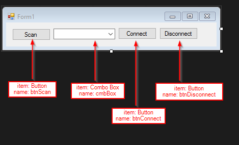

### Introduction to VB

Communicating with the microbit with VB is pretty straight-forward. This is the code that is reused throughout the howto section when connecting to the microbit.

This example uses Visual Studio Community Edition 2015 which is free. The code is a Visual Basic Windows Forms Application on .NET Framework .4.5.2.

### Form Setup

### Very (Very!) Basic Connection Manager


Imports System.IO.Ports

Public Class Form1
    Public Property PortName As String
    Dim WithEvents port As New SerialPort

    Private Sub btnConnect_Click(sender As Object, e As EventArgs) Handles btnConnect.Click
        port.BaudRate = 115200
        port.PortName = cmbBox.SelectedItem.ToString
        port.Parity = Parity.None
        port.DataBits = 8
        port.StopBits = 1
        port.Open()
    End Sub

    Private Sub btnScan_Click(sender As Object, e As EventArgs) Handles btnScan.Click
        ' Show all available COM ports.
        For Each foundPort As String In My.Computer.Ports.SerialPortNames
            cmbBox.Items.Add(foundPort)
        Next
    End Sub

    Private Sub btnDisconnect_Click(sender As Object, e As EventArgs) Handles btnDisconnect.Click
        Try
            port.Close()
            Exit Sub
        Catch
            MessageBox.Show("Could Not Disconnect.")
        End Try
    End Sub
End Class



Whilst this will happily connect to the microbit, there are a number of problems:

* Closing the application leaves the port open.
* Clicking 'Disconnect' without a connection raises an exception.
* Clicking 'Scan' populates cmbBox with items each time it's clicked.
* Clicking 'Connect' raises an exception if it cannot connect.

... and many others!

### Fixing the code


Imports System.IO.Ports

Public Class Form1
    Public Property PortName As String
    Dim WithEvents port As New SerialPort

    Function buttonState()
        'toggle buttons if connected
        If port.IsOpen Then
            btnConnect.Enabled = False
            btnDisconnect.Enabled = True
            cmbBox.Enabled = False
            btnScan.Enabled = False
        Else
            btnConnect.Enabled = True
            btnDisconnect.Enabled = False
            cmbBox.Enabled = True
            btnScan.Enabled = True
        End If

    End Function

    Private Sub btnConnect_Click(sender As Object, e As EventArgs) Handles btnConnect.Click
        ' Connect: open port and toggle button state.
        Try
            port.BaudRate = 115200
            port.PortName = cmbBox.SelectedItem.ToString
            port.Parity = Parity.None
            port.DataBits = 8
            port.StopBits = 1
            port.NewLine = vbCr ' EOL character to CR or \r in .WriteLine and .ReadLine
            port.Open()
            buttonState()

        Catch
            port.Close()
            MessageBox.Show("Could Not Connect. Is mu REPL open?")
        End Try
    End Sub

    Private Sub btnScan_Click(sender As Object, e As EventArgs) Handles btnScan.Click
        ' Scan: Populate cmbBox with found COM ports & Clear prev scans.
        cmbBox.Items.Clear()
        For Each sport As String In My.Computer.Ports.SerialPortNames
            cmbBox.Items.Add(sport)
        Next
        cmbBox.SelectedIndex = 0 ' select first COM port in cmbBox

    End Sub

    Private Sub btnDisconnect_Click(sender As Object, e As EventArgs) Handles btnDisconnect.Click
        ' Disconnect: Close ports & toggle button state.
        Try
            port.Close()
            buttonState()
            Exit Sub
        Catch
            MessageBox.Show("Could Not Disconnect.")
        End Try
    End Sub

    Private Sub Form1_FormClosing(sender As System.Object, e As System.Windows.Forms.FormClosingEventArgs) Handles MyBase.FormClosing
        ' Close Application: Close serial port if open.
        If port.IsOpen() Then
            port.Close()
        End If
    End Sub

    Private Sub Form1_Load(sender As Object, e As EventArgs) Handles MyBase.Load
        buttonState()
    End Sub
End Class


### Notes
* This code won't actually do anything apart from connect to the microbit.
* A better solution would be to use events to handle the dimming of buttons and boxes when connected.
* Adapted from [waihung's blog](http://waihung.net/arduino-controlled-by-visual-basic-program/) & [Martyn Currey's blog](http://www.martyncurrey.com/arduino-and-visual-basic-part-3-controlling-an-arduino/)
