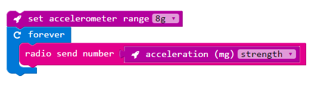
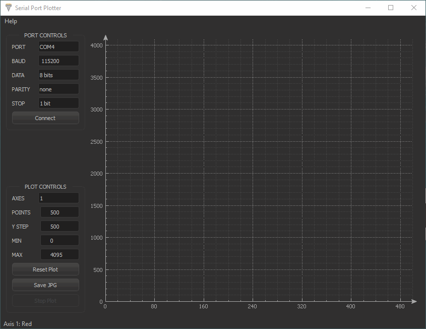

```
DRAFT NOTES:

Everything that follows is wrong.
```
<iframe width="560" height="315" src="https://www.youtube.com/embed/OLzhXRwUhrw" frameborder="0" allowfullscreen></iframe>

ARM have a very cool video on YouTube about juggling and sensor reading. They wirelessly graph the readings from accelerometer readings on three microbits.

This example shows you how to do this with one microbit; I'm not as clever as ARM! You will need two microbits:

* TX microbit: sends the accelerometer data.
* RX microbit: receives the data and streams it to our computer over a serial connection.

The data is then charted on a computer attached to the RX microbit.

## Option 1: PXT TX microbit --> Python RX microbit

In this example, a TX microbit running PXT streams accelerometer readings to a RX microbit running Python. The RX microbit then sends data to the computer over serial.

{:.ui .dividing .header}
### TX Microbit Code

#### Change Sensitivity of accelerometer
By default, the accelerometer has a sensitivity of 1g in addition to earth's gravity. If we're measuring the acceleration of a ball being thrown, we will need to measure a wider range.

This can be done with the sensitivity block:


Set it to 4 or 8g. [Microsoft README about the sensitivity](https://codethemicrobit.com/reference/input/set-accelerometer-range)

#### Return Total Acceleration

The accelerometer on the microbit returns a value in milli-g across three axes: _x_,_y_ & _z_. It can also calculate the total acceleration across all the axes.


Set it to return 'strength'. This is the total acceleration across each axis. [PXT README about the acceration](https://codethemicrobit.com/reference/input/acceleration)

#### Send Wireless Data

We use the 'RADIO SEND' block to send the value wirelessly. The final program looks like this:



{:.ui .dividing .header}
### RX Microbit Code

We will use Python for the RX microbit and connect it to our computer with a USB cable. It will take the readings from the `TX microbit` and output the readings to the computer over a serial connection. This streaming data will be used to chart the readings.

#### Import and Switch on Radio:

The radio module must be imported and the radio switched on:



import radio

from microbit import *

radio.on()



#### Format of Returned Data

The program used on the computer is called SerialPortPlotter. It will take the data from the serial port and chart it.

The returned data must be in a particular format for the program to understand. For this program, it must be:

```
$variable1 variable2 variable3;
```

A maximum of three integers are separated from the other with a space. The frame of data begins with a `$` and ends with `;`.

We are charting only one variable so the output from the microbit is:

```
$variable1$
```

#### Final RX Code


from microbit import *

import radio

radio.on()

while True:
    incoming_data = radio.receive()
    if incoming_data:
        print("$%s;" % incoming_data)  #  format: $incoming_data;
        sleep(10)



{:.ui .dividing .header}
## Option 2: Python TX microbit --> Python RX microbit

<div class="ui message">
  <div class="header">
    Using Python?
  </div>
  <p>Only for use if using Python on the TX microbit as well.</p>
</div>

In this example, a TX microbit running Python streams accelerometer readings to a RX microbit also running Python. The RX microbit then sends data to the computer over serial.

There are two issues to overcome if using Python: setting the sensitivity and returning total strength.

#### Setting Sensitivity

The sensitivity of the accelerometer cannot be set directly in Python. An i2c command must be sent to the accelerometer to change its sensitivity. This is done with:


i2c.write(0x1d, b'\x2a\x00') # disable the device

# i2c address of accelerometer: 0x1d
# XYZ_DATA_CFG register:        x0e

# i2c.write(0x1d, b'\x0e\x00') # set range to 2g
# i2c.write(0x1d, b'\x0e\x01') # set range to 4g
i2c.write(0x1d, b'\x0e\x02') # set range to 8g

i2c.write(0x1d, b'\x2a\x21') # enable device, sample rate of 50Hz


#### Returning Total strength

The total acceleration (as plotted in the video) needs to be calculated. This is done with:


from microbit import *

from math import sqrt

i2c.write(0x1d, b'\x2a\x00') # disable the device

# i2c address of accelerometer: 0x1d
# XYZ_DATA_CFG register:        x0e

i2c.write(0x1d, b'\x0e\x00')     # set range to 2g
# i2c.write(0x1d, b'\x0e\x01')   # set range to 4g
# i2c.write(0x1d, b'\x0e\x02')   # set range to 8g

i2c.write(0x1d, b'\x2a\x21')    # enable with sample rate of 50Hz

while True:
    x = accelerometer.get_x()
    y = accelerometer.get_y()
    z = accelerometer.get_z()

    total = sqrt(x**2 + y**2 + z**2)
    print(int(total))
    sleep(100)


This is the  root of the sum of squares, or Pythagoras in 3d.

{:.ui .dividing .header}
## Option 3: PXT Bluetooth TX microbit --> Computer

```
Draft Notes:

I cannot do this with bluetooth in PXT.

I can do it in C++ with:

  {
      "microbit-dal": {
          "bluetooth": {
              "pairing_mode": 1,
          },
      }
  }

I either need to turn off pairing in PXT
or work out how to pair with the Bluegiga BLED112 dongle.
```

{:.ui .dividing .header}
### Charting Data on the Computer

The output from the TX microbit is received by the RX microbit and read by the computer over a serial connection.

A charting program is used to plot the data.

#### Serial Port Plotter

Download the SerialPortPlotter program [from the ARM website](https://developer.mbed.org/users/borislav/notebook/serial-port-plotter/). Extract and run the `SerialPortPlotter.exe` program.

{:.ui .image}

##### Set Port Controls

In the top left you must select options for the port you wish to connect to. These are:

* PORT: Whichever COM corresponds to your microbit
* BAUD: 115200 is the default baud rate of the microbit in Python
* DATA: 8 bits
* PARITY: none
* STOP: 1 bits

Click 'connect' to chart data.

##### Set Plot Options

The frequency at which the chart is updated can be changed by introducing a `sleep` command on the microbit.

* AXES: The number of variables sent as data. Maximum of 3
* POINTS: Number of data points plotted
* YSTEP: Y-axis steps
* MIN: Minimum value charted
* MAX: Maximum value charted

```
DRAFT NOTES:

Ideally the plotting program should be in Python.

I cannot get it working with matplotlib.

I think I need to have a buffer for it to update smoothly.
```
