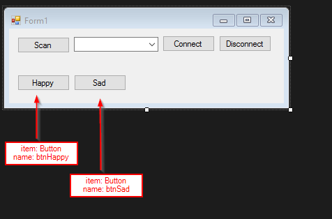

### Introduction to VB

[With the connection manager to the microbit written](howto/connect-to-microbit-in-visual-basic), it's very easy to send simple commands to the microbit.

In this example the microbit runs python (a blank program can be flashed). Visual Basic will send commands to the microbit:

* `display.show(Image.HAPPY)`
* `display.show(Image.SAD)`

### Form Setup

### Code

With the connection manager written and with the new form elements added there are only two things to do:

* Do something if `btnHappy` and `btnSad` are clicked
* Disable `btnHappy` and `btnSad` if not connected to the microbit.

#### Send Command on Click

If the `btnHappy` or `btnSad` send a python command to show the corresponding face on the microbit display.


Private Sub btnHappy_Click(sender As Object, e As EventArgs) Handles btnHappy.Click
    port.WriteLine("display.show(Image.HAPPY)")
End Sub

Private Sub btnSAD_Click(sender As Object, e As EventArgs) Handles btnSad.Click
    port.WriteLine("display.show(Image.SAD)")
End Sub


#### Disable `btnHappy` & `btnSad`

Dimming the buttons is simply a matter of updating the `buttonState()` function:


Function buttonState()
    'toggle buttons if connected
    If port.IsOpen Then
        btnConnect.Enabled = False
        btnDisconnect.Enabled = True
        cmbBox.Enabled = False
        btnScan.Enabled = False
        ' add new buttons
        btnHappy.Enabled = True
        btnSad.Enabled = True
    Else
        btnConnect.Enabled = True
        btnDisconnect.Enabled = False
        cmbBox.Enabled = True
        btnScan.Enabled = True
        ' add new buttons
        btnHappy.Enabled = False
        btnSad.Enabled = False
    End If
End Function


#### Final Code


Imports System.IO.Ports

Public Class Form1
    Public Property PortName As String
    Dim WithEvents port As New SerialPort

    Function buttonState()
        'toggle buttons if connected
        If port.IsOpen Then
            btnConnect.Enabled = False
            btnDisconnect.Enabled = True
            cmbBox.Enabled = False
            btnScan.Enabled = False
            btnHappy.Enabled = True
            btnSad.Enabled = True
        Else
            btnConnect.Enabled = True
            btnDisconnect.Enabled = False
            cmbBox.Enabled = True
            btnScan.Enabled = True
            btnHappy.Enabled = False
            btnSad.Enabled = False
        End If
    End Function

    Private Sub btnConnect_Click(sender As Object, e As EventArgs) Handles btnConnect.Click
        ' Connect: open port and toggle button state.
        Try
            port.BaudRate = 115200
            port.PortName = cmbBox.SelectedItem.ToString
            port.Parity = Parity.None
            port.DataBits = 8
            port.StopBits = 1
            port.NewLine = vbCr ' EOL character to CR or \r in .WriteLine and .ReadLine
            port.Open()
            buttonState()

        Catch
            port.Close()
            MessageBox.Show("Could Not Connect. Is mu REPL open?")
        End Try
    End Sub

    Private Sub btnScan_Click(sender As Object, e As EventArgs) Handles btnScan.Click
        ' Scan: Populate cmbBox with found COM ports & Clear prev scans.
        cmbBox.Items.Clear()
        For Each sport As String In My.Computer.Ports.SerialPortNames
            cmbBox.Items.Add(sport)
        Next
        cmbBox.SelectedIndex = 0 ' select first COM port in cmbBox

    End Sub

    Private Sub btnDisconnect_Click(sender As Object, e As EventArgs) Handles btnDisconnect.Click
        ' Disconnect: Close ports & toggle button state.
        Try
            port.Close()
            buttonState()
            Exit Sub
        Catch
            MessageBox.Show("Could Not Disconnect.")
        End Try
    End Sub

    Private Sub Form1_FormClosing(sender As System.Object, e As System.Windows.Forms.FormClosingEventArgs) Handles MyBase.FormClosing
        ' Close Application: Close serial port if open.
        If port.IsOpen() Then
            port.Close()
        End If
    End Sub

    Private Sub Form1_Load(sender As Object, e As EventArgs) Handles MyBase.Load
        buttonState()
    End Sub

    Private Sub btnHappy_Click(sender As Object, e As EventArgs) Handles btnHappy.Click
        port.WriteLine("display.show(Image.HAPPY)")
    End Sub

    Private Sub btnSAD_Click(sender As Object, e As EventArgs) Handles btnSad.Click
        port.WriteLine("display.show(Image.SAD)")
    End Sub
End Class

### Notes

* A better solution would be to use events to handle the dimming of buttons and boxes.
