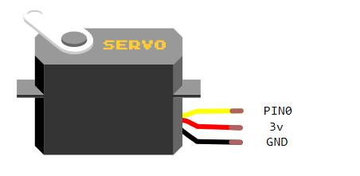
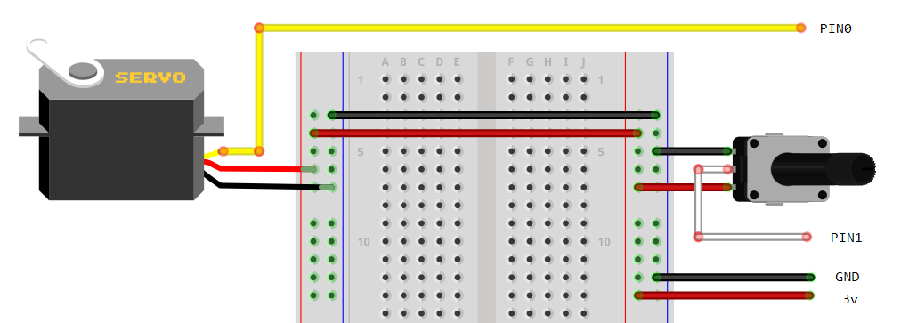

"""
Unchecked.

There are a few PWM issues.
"""

These examples us the The Tower Pro SG90 servo. This is a 180° servo meaning it can turn from 0° to 180°.

[See the component article on this website about how to use the servo.](/components/servo)

{:.ui .header .dividing}
### Microbit Twist
##### Hardware Required
* 3.3v Servo

Moving the microbit causes the servo to rotate.

{:.ui .image}


from microbit import *

from servo import Servo

def rescale(src_scale, dest_scale, x):
    src_start, src_end = src_scale
    proportion = 1.0 * (x - src_start) / (src_end - src_start)
    dest_start, dest_end = dest_scale
    return proportion * (dest_end - dest_start) + dest_start

while True:
    # rescale accelerometer x axis to between 0 and 180
    rescaled_angle = rescale(
                     (-1023, 1023),
                     (0, 180),
                     accelerometer.get_x())

    Servo(pin0).write_angle(rescaled_angle)
    sleep(200)


{:.ui .header .dividing}
### Potentiometer

##### Hardware Required
* 3.3v Servo
* 10k Potentiometer

Turning the potentiometer causes the servo to rotate.

[See the component article for a potentiometer](/components/potentiometer) for more.

{:.ui .image}


from microbit import *

from servo import Servo

def rescale(src_scale, dest_scale, x):
    src_start, src_end = src_scale
    proportion = 1.0 * (x - src_start) / (src_end - src_start)
    dest_start, dest_end = dest_scale
    return proportion * (dest_end - dest_start) + dest_start

servo1 = Servo(pin0)
pot_reading = pin1.analog_read()

while True:
    # rescale pot reading (0 - 1023) to servo angle (0 - 180)
    rescaled_angle = rescale(
                     (0, 1023),
                     (0, 180),
                    pot_reading)

    servo1.write_angle(rescaled_angle)
    sleep(200)


{:.ui .header .dividing}
### Buttons
##### Hardware Required
* 3.3v Servo

`button_a` and `button_b` control the rotation of the servo. Be sure to upload the servo class in mu.

{:.ui .image}


# Each time button_a is pressed and the value of angle is less
# than or equal to 180, increment the value of the servo's
# rotation by 10. Do similar for button_b.

from microbit import *

from servo import Servo

# angle to write to the servo.
angle = 0    

# reset servo to 0 degrees
Servo(pin0).write_angle(angle)

while True:
    if button_a.was_pressed and (angle <= 180):
        angle = angle + 10
        Servo(pin0).write_angle(angle)

    if button_a.was_pressed and (angle >= 0):
        angle = angle - 10
        Servo(pin0).write_angle(angle)

    sleep(10)

