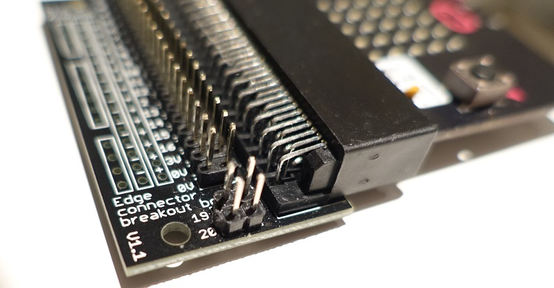
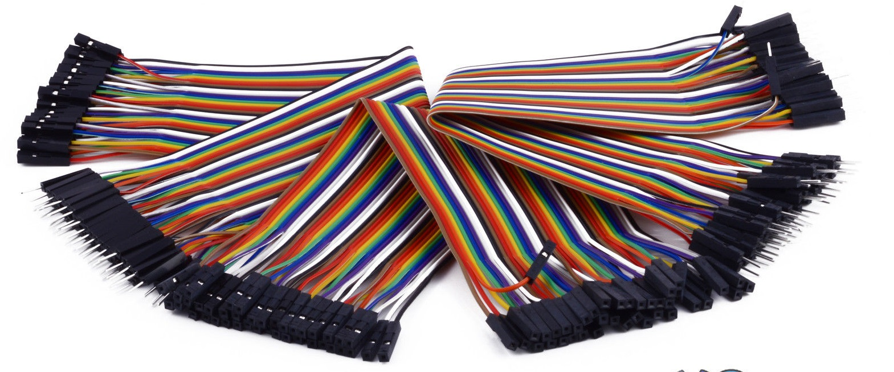

Peripherals can be attached to the microbit over the I2C serial interface.

These sensors, displays and EEPROMS can all be attached to the microbit to extend its functionality.

The are already two onboard devices attached to the microbit's I2C bus: the onboard accelerometer and magnetometer.

The I2C bus is consists of two signals: SCL and SDA. These are exposed on the microbit's `pin19` and `pin20` respectively. I2C peripherals attached to these pins join the microbit's I2C bus.

There is a [fantastic introduction](https://learn.sparkfun.com/tutorials/i2c) about I2C on SparkFun.

### Edge Connector

Referring to the microbit pin out diagram, the I2C bus is on `pin19` and `pin20`:

{:.ui .image .fluid}

`pin19` & `pin20` are on the small pins between the `3v` and `GND` pads. A microbit edge connector is needed to access these pins.

The microbit's pins (or the edge connector) slots into a socket on the edge connector. This then exposes header pins. Each header pin has the microbit pin number. On this edge connector, `pin19` and `pin20` are exposed on the far right.

{:.ui .image .fluid}

Hookup wire with a Dupont connector can then connect to the header pin of the edge connector.

These are usually in PCB hookup wire kits or available from your local Chinese eBay seller in massive ribbons:

{:.ui .image .fluid}

