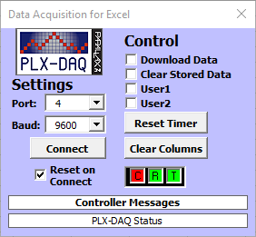

It is possible to chart data from the microbit in Excel in real time. However, it's important to note Excel was never designed for this and has some limitation.

Parallax Data Acquisition Tool (PLX-DAQ) is used to acquire the data which is then charted in Excel.

In this example, the value of the x, y & z axis of the accelerometer is plotted in a chart.

### 1. Install Windows Software

1. Download and install [PLX-DAQ](https://www.parallax.com/downloads/plx-daq)

2. Open the `PLX-DAQ` folder on your desktop.

3. Open the `PLX-DAQ` spreadsheet file.

### 2. Flash Microbit Code

This script runs on the microbit and sends the accelerometer readings over a serial connection.


from microbit import *

# Tell excel to clear previous data
print("CLEARDATA")

# Tell excel the column header names
print("LABEL,Time,Milliseconds,xaxis,yaxis,zaxis")

# Reset the timer added by Excel
print("RESETTIMER");

while True:
    print("DATA,TIME,TIMER, %s, %s, %s" % (accelerometer.get_x(),
                                           accelerometer.get_y(),
                                           accelerometer.get_z()))
    sleep(100)


### 3. Connect & Collect Data

{:.ui .image}

Select ports and baud speed (115200; not 9600) and click 'Connect'.

Press the 'reset' button on the back of the microbit. Data from the microbit will stream into the spreadsheet. Charts can be drawn which are updated in real-time.
