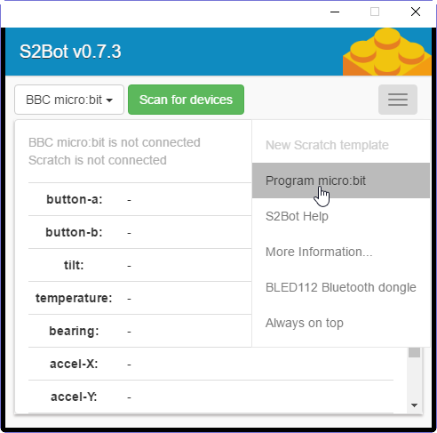
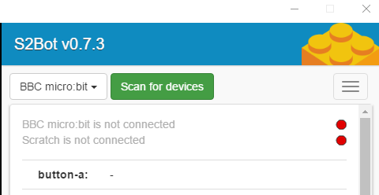
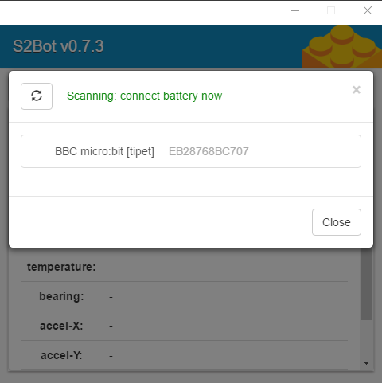
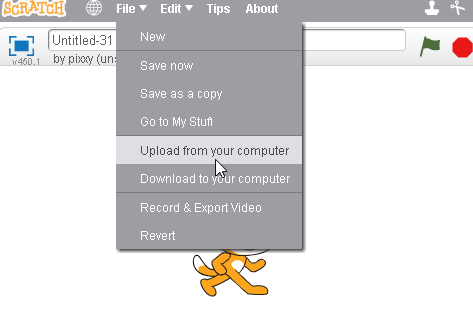
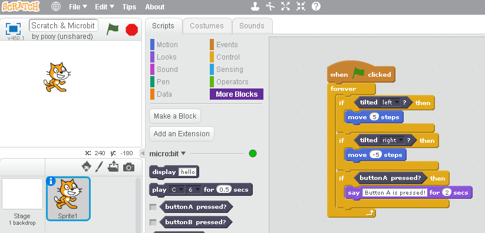

### Required Dongle

A Bluetooth dongle is required to wirelessly interact with the microbit. The [Bluegiga BLED112 Bluetooth Smart Dongle](https://www.silabs.com/products/wireless/bluetooth/bluetooth-smart-modules/Pages/bled112-bluetooth-smart-dongle.aspx) is used by S2Bot. It's around £10.

You will also need to use Chrome as your browser.

#### 1. Install S2Bot App

A Chrome extension must be installed to communicate with the microbit. [Install it from the Chrome store.](https://chrome.google.com/webstore/detail/s2bot-4-scratch/pllkalmkifgmanfoghenhgafbcpbicdj?hl=en-GB)

#### 2. Upload the `.hex` file to the microbit

The microbit must run a separate `.hex` file:

* Open S4Bot and click 'program microbit' (above)

* A dialog box will open. Locate the microbit's drive and click save. This copies over a `.hex` file for the microbit to run.

* The microbit will now instruct you to draw a circle to calibrate the compass.

#### 3. Scan for the Microbit

* Within the S4Bot app, select 'BBC: Microbit' and then 'Scan for Device'.

#### 4. Connect to the Microbit

* Select your microbit from the list.

#### 5. Save Scratch Template

* Within the 'S4Bot' app, click 'New Scratch Template'. Save the file to your computer.

#### 6. Open Scrach & Open Template

* Visit the [Scratch](https://scratch.mit.edu/) online editor

* Click 'File > Upload from your Computer'

#### 7. Use Template

* Microbit blocks are now available under the 'More Blocks' tab.

Here's a moving cat:

{:.ui .image .fluid}

One day this process will be so much easier!
