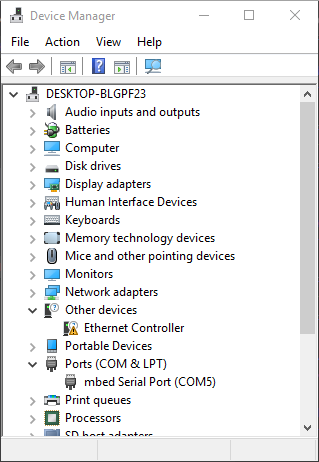
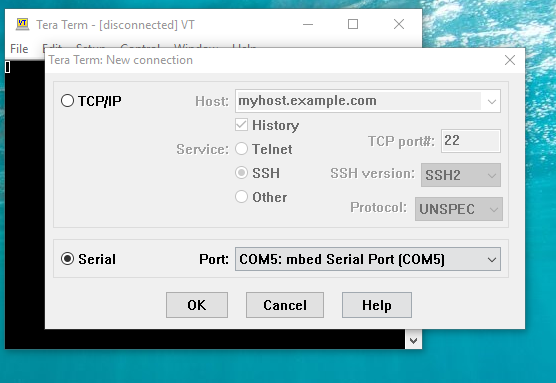
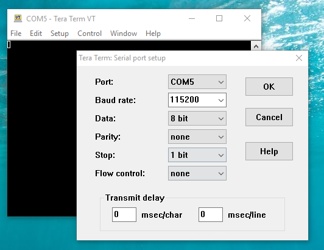
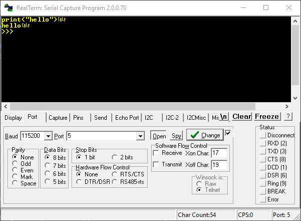

The microbit has a USB serial interface allowing serial communication over USB. The 'REPL' feautre in mu is a serial connection to the microbit.

To access this interface, the mbed serial drivers must be installed:

* [download serial driver](https://developer.mbed.org/media/downloads/drivers/mbedWinSerial_16466.exe)

Once installed, plugging in the microbit will cause a COM port to appear on the the host computer:

This indicates the microbit is attached to COM port 5.

With this, it's possible to connect to the microbit with a terminal application. The microbit can take instructions over the terminal. It can communicate with microbit flashed with a PXT-based or Python-based hex file.

{:.ui .dividing .header}
### Terminal Applications

The settings for the terminal connection are the same whether it's a `pxt`or `python` hex:

* BAUD: 115200
* DATA: 8 bits
* PARITY: none
* STOP: 1 bits

#### Tera Term

[Tera Term is an open source](https://osdn.net/projects/ttssh2/releases/) application that's straight forward to use:

Open the correct COM port:

Change connection properties under `Connection > Serial...`:

#### Realterm

[Realterm](http://realterm.sourceforge.net/) is an open source terminal application that's a little more complicated than Tera Term. It gives more options, especially when logging.

### Note about Serial UART & Python

This example, and many others on this website, connects to a python microbit over USB. It uses the `115200` baud rate by default. It also tends to use `print()` instead of `uart.write()`.

It's possible to use the `uart` module to read and write data, change the baud rate, and use the physical pins as opposed using USB.

It's important to note `uart.write("hello")` and `print("hello")` are exactly the same: they both output to `stdout`.

However the `uart` module exposes many useful functions such as `uart.readall()` and `uart.any()`

There's more [on the microbit python documentation](http://microbit-micropython.readthedocs.io/en/latest/uart.html).

### Going Further

Establishing a serial connection is useful when developing applications on the computer to interact with the microbit:

* [Example of serial connection in Small Basic](/howto/microbit-to-small-basic)
