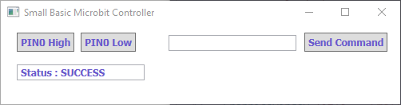

You can write a simple GUI to send commands to a microbit running Python:

{:.ui .image .centered}

The program sends Python commands over a serial connection to the microbit. I've kept it as simple as possible so you can customise it further.

Clicking *PIN0 High* sends the command `pin0.write_digital(1)` to the microbit. You could type `display.show(Image.HAPPY)` and click *Send Command* would show a smiley on the microbit.

{:.ui .dividing .header}
### How To

1. Flash a Python program to the microbit. You can just flash an empty program from within mu.

2. Install the [lit dev extensions](http://litdev.co.uk/) for Small Basic. These are used to communicate over a serial connection.

3. Find out the COM port of your microbit.

4. Add your COM port at the top of the Small Basic code.

{:.ui .dividing .header}
### Code

```
comPort = "COM4"

Initialise()

While ("True")
  Program.Delay(10)
EndWhile

Sub Initialise
  'draw window'
  GraphicsWindow.Width = 500
  GraphicsWindow.Height = 100
  GraphicsWindow.Title = "Small Basic Microbit Controller"

  'draw pin control buttons'
  pin0high = Controls.AddButton("PIN0 High", 20, 10)
  pin0low = Controls.AddButton("PIN0 Low", 100, 10)

  'draw status and command buttons & boxes'
  statusbox = Controls.AddTextBox(20,50)
  value = Controls.AddTextBox(210,13)
  send = Controls.AddButton("Send Command", 380, 10)

  'Open connection to microbit'
  Controls.SetTextBoxText(statusbox,"Status : "+ LDCommPort.OpenPort(comPort, 9600))

  'Assign variables'
  Controls.ButtonClicked = OnButtonClicked
  nl = Text.GetCharacter(10) 'new line character'
EndSub

Sub OnButtonClicked
  button = Controls.LastClickedButton
  val = Controls.GetTextBoxText(value)

  'if button pressed, send command and new line character'
  If (button = pin0high) Then
    LDCommPort.TXString("pin0.write_digital(1)+nl")
  ElseIf (button = pin0low) Then
    LDCommPort.TXString("pin0.write_digital(0)+n1")
  EndIf
  If (button = send) And (val <> "") Then
    LDCommPort.TXString(val+nl)
  EndIf
EndSub

```
Adapted from [litdev on a MSDN blog](https://blogs.msdn.microsoft.com/smallbasic/2016/03/22/small-basic-arduino/)

### Notes
* This is not interactive; it will not return any value the microbit sends.
* This will only work over USB. Python does not work over Bluetooth.
