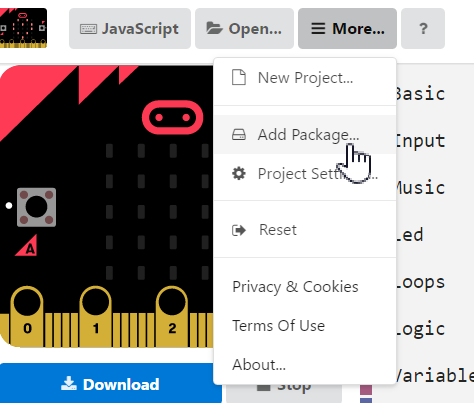
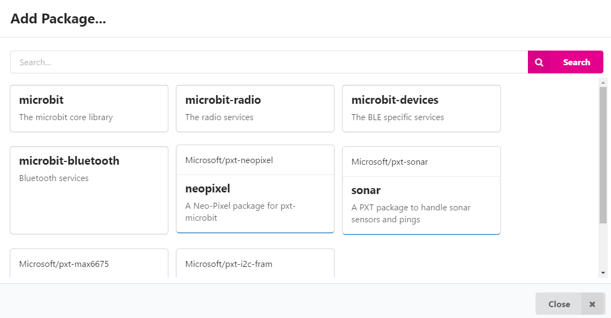
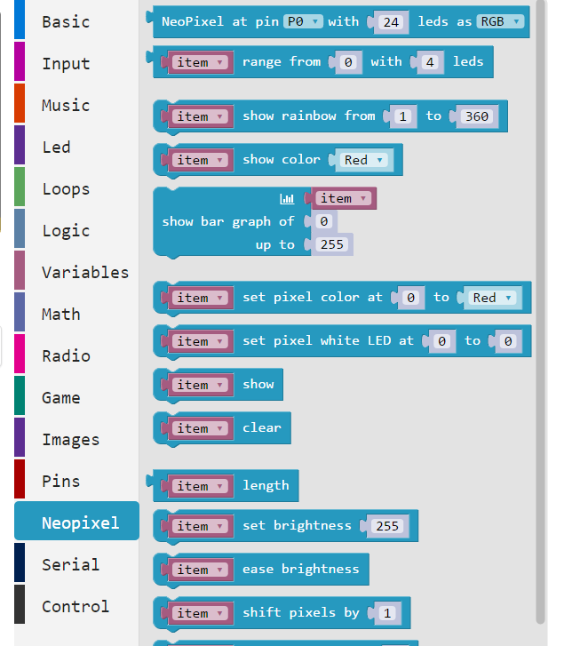

The PXT.IO editor can use packages to add additional components or for extra functionality to the microbit. At present, there are libraries to use a sonar sensor, neopixels and a thermocoupler.

Here's the full list:

* [pxt-max6675](https://github.com/Microsoft/pxt-max6675)
* [pxt-neopixel](https://github.com/Microsoft/pxt-neopixel)
* [pxt-sonar](https://github.com/microsoft/pxt-sonar)
* [pxt-i2c-fram](https://github.com/microsoft/pxt-i2c-fram)
* [Sample C++ extension](https://github.com/Microsoft/pxt-microbit-cppsample)
* [Sample TypeScript extension](https://github.com/Microsoft/pxt-microbit/tree/master/libs/i2c-fram)

To drive neopixels, you need to add the neopixel package to your program:

#### Click 'Add Package'
{:.ui .image .medium .centered}

#### Select the Package to Use
{:.ui .image .medium .centered}

#### Use the Package in your Program
{:.ui .image .medium .centered}

### Notes

* It's possible to write your own packages. There's a write up [here.](https://github.com/Microsoft/pxt-microbit/blob/master/docs/packages.md). These are added to PXT.io if approved by microsoft (?)
* PXT.io can be run from a local machine.
* Unlike the TouchDevelop platform for the microbit, you cannot add your own packages. To do this, you must install PXT on a local machine.
* A list of the current packages is in a [README file](https://github.com/Microsoft/pxt-microbit/blob/master/docs/packages.md) on Github.
