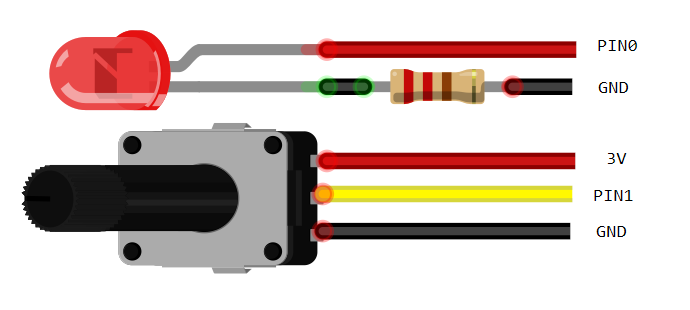
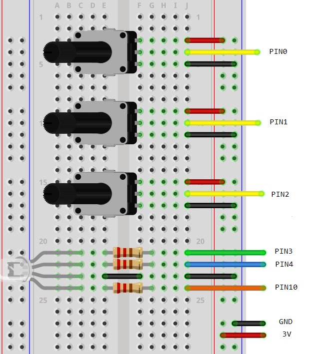

All examples use a simple 10k potentiometer.

[See the component article on this website about the LED.](/components/potentiometer)

{:.ui .header .dividing}
### Dimming LED
Dim and LED based on the reading/rotation of the potentiometer.
### Pot always pin 1

#### Hardware Required
* LED
* 220Ω resistor
* 10kΩ potentiometer

{:.ui .image}

<a class="item active" data-tab="first">Python</a>
<a class="item" data-tab="second">PXT.io</a>


from microbit import *

pot = pin1
led = pin0

while True:
    led.write_analog(pot.read_analog())
    sleep(100)


This should work a lot better than it does.

The LED flickers each time `write_analog()` is called. Hopefully someone has a solution.


let potReading = 0

basic.forever(() => {
    potReading = pins.analogReadPin(AnalogPin.P1)
    pins.analogWritePin(AnalogPin.P0, potReading)
})



{:.ui .header .dividing}
### RGB Colour Mixing
Mix colours based on the reading from three potentiometers.

#### Hardware Required
* RGB LED
* 3 &times; 220Ω resistors
* 3 &times; 10kΩ potentiometer
* microbit breakout board

{:.ui .image}


from microbit import *

# potentiometer pins
red_pot = pin0
green_pot = pin1
blue_pot = pin2

# led pins
red_led = pin10
green_led = pin3
blue_led = pin4

while True:
    # get colors from pots
    # returned values range from 0 - 1023
    red = red_pot.analog_read()
    green = green_pot.analog_read()
    blue = blue_pot.analog_read()

    # write colours to LEDs
    red_led.analog_write(red)
    green_led.analog_write(green)
    red_led.analog_write(blue)

    sleep(100)

